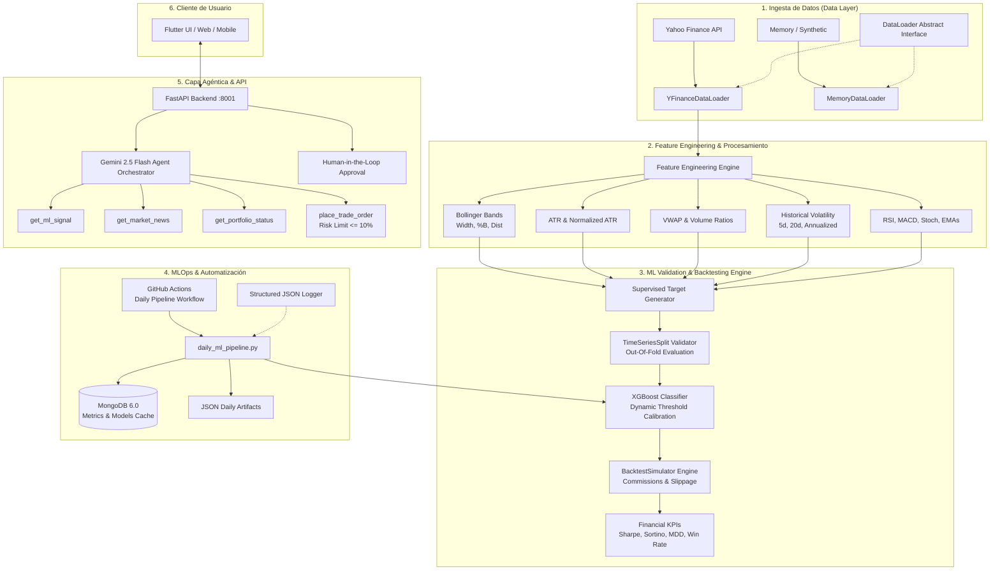

# 📈 Acciones Inteligentes - Plataforma Cuantitativa, MLOps y Agentes Financieros Autónomos

[](https://github.com/vitif/Acciones-Inteligentes/actions)
[](https://www.python.org/)
[](https://opensource.org/licenses/MIT)

**Acciones Inteligentes** es un ecosistema cuantitativo y de Machine Learning de grado profesional para análisis, predicción, simulación de backtesting y toma de decisiones en mercados financieros. 

Combina modelos de gradiente potenciado (**XGBoost**), ingeniería de características técnicas de alta dimensionalidad (**ta / pandas-ta**), validación temporal sin filtraciones (**Walk-Forward / TimeSeriesSplit**), un simulador de **Backtesting** con comisiones y *slippage*, orquestación de **MLOps** mediante GitHub Actions y Docker, y una capa de razonamiento y ejecución con **Agentes Financieros Autónomos (Gemini 2.5 Flash + Human-in-the-Loop)**.

---

## 🏛️ Arquitectura del Sistema



---

## 🚀 Características Principales por Módulo

### 1. Robustez de Machine Learning & Backtesting
* **Cero Data Leakage:** Reemplazo de divisiones aleatorias/estáticas por `TimeSeriesSplit` y validación *walk-forward* con métricas *Out-Of-Fold (OOF)*.
* **Calibración Dinámica de Umbrales:** Optimización del umbral de probabilidad para maximizar el F1-Score en periodos fuera de muestra.
* **Simulador de Trading Realista:** `BacktestSimulator` calcula retornos netos descontando comisiones de corretaje (`commission_pct`), deslizamiento (`slippage_pct`) y tamaño de posición.
* **Métricas Financieras Cuantitativas:**
  * **Sharpe Ratio & Sortino Ratio** (con tasa libre de riesgo anualizada configurable).
  * **Maximum Drawdown (MDD)** y duración del drawdown.
  * **Win Rate (%)** y **Profit Factor** (Gross Profits / Gross Losses).
  * **CAGR** y **Volatilidad Anualizada**.
  * Comparación directa contra el Benchmark pasivo (**Buy & Hold**).

### 2. Feature Engineering Extensible
* **Abstracción `DataLoader`:** Arquitectura desacoplada bajo el principio de Inversión de Dependencias (DIP) con soporte para `YFinanceDataLoader`, `MemoryDataLoader` y facilidad para agregar nuevos proveedores (AlphaVantage, Polygon, CSV).
* **Indicadores Técnicos Avanzados (`ta`):**
  * Bandas de Bollinger (`BB_High_Dist`, `BB_Low_Dist`, `BB_Width`, `BB_Pct`).
  * Rango Verdadero Promedio (`ATR`, `ATR_Pct`).
  * Precio Ponderado por Volumen (`VWAP`, `VWAP_Dist`).
  * Volatilidad Histórica Móvil (`Volatility_5d`, `Volatility_20d`, `Hist_Vol_Ann`).
  * Medias Móviles Exponenciales (`EMA5`, `EMA20`, `EMA50`), `RSI`, `MACD` y oscilador Estocástico.

### 3. MLOps, CI/CD y Containerización
* **GitHub Actions Workflow (`daily_pipeline.yml`):** Ejecuta diariamente tras el cierre del mercado la suite de pruebas automatizadas, reentrena/evalúa modelos y genera reportes de métricas.
* **Logging Estructurado:** Salida configurable en formato `JSON` estructurado para observabilidad en la nube / producción y modo `TEXT` para desarrollo local.
* **Docker Multi-Stage:** `Dockerfile` basado en Python 3.11-slim con usuario sin privilegios `appuser`, healthcheck integrado y `docker-compose.yml` para orquestar la API, MongoDB y los pipelines batch.

### 4. Agentes Autónomos con Human-in-the-Loop (HITL)
* Inferencia cuantitativa asistida por **Gemini 2.5 Flash**.
* Límite estricto de riesgo por operación ($\le 10\%$ del valor del portafolio).
* Flujo de aprobación humana antes de ejecutar cualquier transacción en la cuenta de Paper Trading.

---

## 🐳 Guía Rápida de Instalación y Despliegue con Docker

### Opción 1: Despliegue Completo con Docker Compose (Recomendado)

1. **Clonar el repositorio:**
   ```bash
   git clone https://github.com/vitif/Acciones-Inteligentes.git
   cd Acciones-Inteligentes
   ```

2. **Crear archivo de entorno `.env` en la raíz (o en `backend/.env`):**
   ```env
   MONGO_INITDB_ROOT_USERNAME=root
   MONGO_INITDB_ROOT_PASSWORD=example
   SECRET_KEY=tu_clave_secreta_jwt_super_segura
   GEMINI_API_KEY=tu_api_key_de_gemini
   LOG_LEVEL=INFO
   LOG_FORMAT=JSON
   ```

3. **Iniciar todos los servicios (MongoDB 6.0 + FastAPI Backend):**
   ```bash
   docker compose up -d --build
   ```

4. **Verificar el estado del servicio:**
   * Backend API: `http://localhost:8001`
   * Documentación Swagger UI: `http://localhost:8001/docs`
   * Health Check: `http://localhost:8001/api/health`

5. **Ejecutar el Pipeline Diario de ML bajo demanda mediante Docker:**
   ```bash
   docker compose run --rm ml_pipeline
   ```

---

### Opción 2: Instalación Local en Desarrollo

1. **Crear y activar el entorno virtual:**
   ```bash
   # Windows
   python -m venv entorno-v
   .\entorno-v\Scripts\activate

   # Linux / macOS
   python3 -m venv entorno-v
   source entorno-v/bin/activate
   ```

2. **Instalar dependencias:**
   ```bash
   pip install --upgrade pip
   pip install -r backend/requirements.txt
   ```

3. **Ejecutar el servidor local:**
   ```bash
   cd backend
   uvicorn main:app --reload --port 8001
   ```

4. **Ejecutar el pipeline diario manual:**
   ```bash
   python backend/scripts/daily_ml_pipeline.py --tickers "AAPL MSFT GOOGL NVDA TSLA" --period "2y"
   ```

---

## 🧪 Pruebas Automatizadas

El proyecto cuenta con una **suite consolidada y unificada** que valida todos los componentes del sistema (API, Billeteras, Agente Autónomo, TimeSeriesSplit, Backtesting, DataLoader, Features y Pipeline Diario).

Para ejecutar la suite completa de pruebas:

```bash
# Desde el directorio backend
pytest tests_consolidated.py -v
```

### Resultados de la Suite Unificada:
```text
backend/tests_consolidated.py::test_health_check PASSED                  [  4%]
backend/tests_consolidated.py::test_get_me_protected PASSED              [  9%]
backend/tests_consolidated.py::test_market_data PASSED                   [ 14%]
backend/tests_consolidated.py::test_wallet_logic PASSED                  [ 19%]
backend/tests_consolidated.py::test_order_matcher PASSED                 [ 23%]
backend/tests_consolidated.py::test_websocket_market PASSED              [ 28%]
backend/tests_consolidated.py::test_register_normalization PASSED        [ 33%]
backend/tests_consolidated.py::test_login_normalization PASSED           [ 38%]
backend/tests_consolidated.py::test_agent_tools_ml_signal PASSED         [ 42%]
backend/tests_consolidated.py::test_agent_tools_portfolio_risk_limit PASSED [ 47%]
backend/tests_consolidated.py::test_agent_orchestrator_decision_loop PASSED [ 52%]
backend/tests_consolidated.py::test_agent_endpoints_flow PASSED          [ 57%]
backend/tests_consolidated.py::test_calculate_financial_metrics PASSED   [ 61%]
backend/tests_consolidated.py::test_backtest_simulator_execution PASSED  [ 66%]
backend/tests_consolidated.py::test_timeseries_validator PASSED          [ 71%]
backend/tests_consolidated.py::test_train_and_backtest_pipeline_mocked PASSED [ 76%]
backend/tests_consolidated.py::test_data_loader_factory_and_memory_loader PASSED [ 80%]
backend/tests_consolidated.py::test_advanced_technical_indicators PASSED [ 85%]
backend/tests_consolidated.py::test_pipeline_with_custom_dataloader PASSED [ 90%]
backend/tests_consolidated.py::test_json_formatter_structure PASSED      [ 95%]
backend/tests_consolidated.py::test_run_daily_pipeline_execution PASSED  [100%]

======================= 21 passed, 1 warning in 26.79s ========================
```

---

## ⚠️ Disclaimer Financiero y Legal

> ### 🛑 AVISO LEGAL IMPORTANTE / FINANCIAL DISCLAIMER
> 
> 1. **Propósito Exclusivamente Educativo y de Investigación:**  
>    Este software, sus modelos de Machine Learning, simulaciones de backtesting, señales predictivas y los dictámenes generados por Agentes de Inteligencia Artificial han sido desarrollados con fines exclusivamente académicos, investigativos y de demostración tecnológica.
> 
> 2. **No Constituye Asesoramiento Financiero:**  
>    Ningún contenido emitido por este sistema constituye una oferta, recomendación, solicitud o asesoramiento financiero personalizado, legal o tributario. Los mercados de valores y derivados implican riesgos significativos de pérdida de capital.
> 
> 3. **Rendimientos Pasados y Simulaciones:**  
>    Los rendimientos pasados, las métricas de backtesting (Sharpe Ratio, Win Rate, CAGR, etc.) y las simulaciones cuantitativas no garantizan ni predicen de ninguna manera resultados futuros.
> 
> 4. **Limitación de Responsabilidad:**  
>    Los autores y desarrolladores de este proyecto no asumen ninguna responsabilidad por decisiones de inversión, pérdidas directas o indirectas, o daños derivados del uso o interpretación de este software. Cualquier operación real en el mercado queda bajo la exclusiva responsabilidad y criterio del usuario.

---

## 📄 Licencia

Este proyecto está distribuido bajo la Licencia **MIT**. Consulta el archivo `LICENSE` para más detalles.
